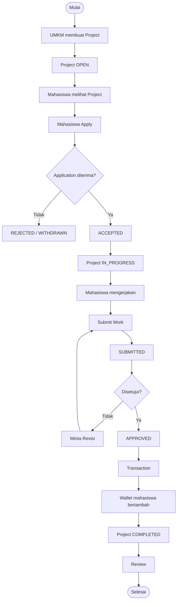

<p align="center">
  
</p>

<h1 align="center">KIVU</h1>
<p align="center"><strong>Marketplace Micro-Freelance Mahasiswa × UMKM</strong></p>

<p align="center">
  
  
  
  
  
  
</p>

<p align="center">
  <a href="prd.md">📄 PRD</a> ·
  <a href="security.md">🔒 Keamanan</a> ·
  <a href="https://github.com/wanfauzi/kivu-laravel">🌐 Repo</a>
</p>

---

## Tentang

**KIVU** menghubungkan **Mahasiswa/Talent** dengan **UMKM** untuk mengerjakan proyek micro-freelance berbayar. Alur intinya berjalan end-to-end dan datanya nyata (bukan halaman statis):

> Posting → Lamar → Terima → Kirim → Setujui → Bayar → Selesai

Di atas alur inti tersedia lapisan **kepercayaan** (verifikasi KTM, reputasi/ulasan, portofolio, profil publik) dan **tata kelola** (sengketa, moderasi, penarikan saldo).

## Fitur

### Mahasiswa / Talent
- Melihat **peluang** (cari, filter budget, sort, pagination) & **detail proyek**.
- **Melamar** proyek, **membatalkan** lamaran (PENDING), **melamar ulang**.
- **Kirim hasil** setelah diterima, lalu **kirim ulang** bila diminta **revisi**.
- **Dompet**: saldo, pendapatan, riwayat transaksi, **tarik saldo** (batalkan bila PENDING).
- **Verifikasi KTM** (unggah; email `.ac.id` otomatis terverifikasi) + lencana **Mahasiswa Terverifikasi**.
- **Profil**: bio, keahlian (skill), **portofolio** (file/URL), rating & ulasan diterima.
- **Ajukan sengketa** dan membatalkannya.

### UMKM
- **Buat**, **edit**, dan **batalkan** proyek.
- **Kelola pelamar**: lihat reputasi, **terima**, atau **tolak** (dengan catatan alasan).
- **Tinjau hasil**, **Setujui & Bayar**, atau **Minta Revisi**.
- **Beri ulasan** setelah proyek selesai.
- Lihat **profil publik** pelamar, **ajukan sengketa**, kelola **profil**.

### Admin
- **Dashboard** metrik (pembayaran bersih, penarikan, KTM, sengketa).
- **Kelola pengguna**: **verifikasi/batalkan KTM**, **suspend/aktifkan**.
- **Moderasi proyek** (takedown), **Transaksi**, **Penarikan** (setujui/tolak).
- **Sengketa**: **Refund**, **Release**, atau **Tolak**.

## Tech Stack

| Layer | Teknologi |
|---|---|
| Framework | Laravel 13 |
| Bahasa | PHP 8.3+ |
| UI Dinamis | Livewire 4 + Blade |
| CSS | Tailwind CSS v4 |
| Build | Vite 8 |
| Database | MySQL 8 |
| ORM | Eloquent |
| Auth / Otorisasi | Laravel Auth + Middleware + Gate/Policy |

## Alur (Golden Path)



## Persyaratan

- PHP **8.3+** (disarankan 8.4/8.5) dengan ekstensi standar Laravel
- Composer 2
- Node.js 18+ & NPM
- MySQL **8**

## Instalasi

```bash
# 1. Clone
git clone https://github.com/wanfauzi/kivu-laravel.git
cd kivu-laravel

# 2. Dependency PHP
composer install

# 3. Konfigurasi environment
cp .env.example .env
php artisan key:generate
```

Atur koneksi database di `.env` (buat database `kivu` terlebih dahulu):

```env
DB_CONNECTION=mysql
DB_HOST=127.0.0.1
DB_PORT=3306
DB_DATABASE=kivu
DB_USERNAME=root
DB_PASSWORD=
# Hapus/komentari DB_SOCKET bila memakai koneksi TCP
```

```bash
# 4. Migrasi + data demo
php artisan migrate --seed

# 5. Storage link (untuk file publik/portofolio)
php artisan storage:link

# 6. Frontend
npm install
npm run build

# 7. Jalankan
php artisan serve
# Buka http://127.0.0.1:8000
```

## Akun Demo

| Role | Email | Password |
|---|---|---|
| Admin | `admin@kivu.id` | `password` |
| UMKM | `umkm@kivu.id` | `password` |
| Mahasiswa | `talent@kivu.id` | `password` |

> ⚠️ Kredensial ini **hanya untuk demo**. Ganti sebelum produksi (lihat [`security.md`](security.md)).

Muat ulang **data demo lengkap** (9 proyek berbagai status, lamaran, submission, dompet, penarikan, transaksi, ulasan, sengketa, portofolio) dengan:

```bash
php artisan demo:reset --force
```

Rincian akun & data: [`docs/demo-data.md`](docs/demo-data.md).

## Menjalankan

**Pengembangan** (hot reload + server):

```bash
php artisan serve
npm run dev
```

**Produksi** (optimasi cache):

```bash
npm run build
php artisan config:cache
php artisan route:cache
php artisan view:cache
```

> Catatan: karena `config:cache` aktif, setiap perubahan `.env` perlu `php artisan config:clear`.

## Backup Database

Backup database memakai perintah artisan:

```bash
php artisan db:backup                 # backup database (terkompresi)
php artisan db:backup --keep=14       # simpan 14 hari terakhir
php artisan db:backup --with-files    # ikut file upload (KTM/portofolio) + .env
```

Hasil tersimpan di `storage/backups/` (tidak ikut ke Git).

**Restore:**

```bash
gunzip -c storage/backups/kivu-YYYY-mm-dd_HH-MM-SS.sql.gz | mysql -u root -p kivu
```

## Keamanan

KIVU menerapkan: password hashing, sesi aman, proteksi brute-force (rate limit), otorisasi berlapis (middleware + Policy/Gate), validasi input & escaping (anti-XSS), CSRF, ORM (anti-SQLi), upload aman, penyimpanan KTM privat, serta operasi keuangan yang **atomik** (anti dobel-bayar/tarik).

Detail lengkap, risiko, dan rekomendasi ada di **[`security.md`](security.md)**.

## Struktur Folder (ringkas)

```text
app/
├── Console/Commands/    # db:backup
├── Http/Controllers/    # AuthController, KtmController
├── Http/Middleware/     # RoleMiddleware
├── Livewire/
│   ├── Public/          # Landing, TalentProfile
│   ├── Student/         # Dashboard, Opportunities, ProjectDetail, MyApplications, SubmitWork, Wallet, Profile
│   ├── Umkm/            # Dashboard, Create/EditProject, MyProjects, ManageApplicants, ReviewSubmission, Profile
│   └── Admin/           # Dashboard, Users, Projects, Transactions, Withdrawals, Disputes
├── Models/
├── Policies/
└── Services/            # StudentTrust
resources/views/         # Blade + komponen <x-ui.*>, <x-icon>
routes/web.php
prd.md · security.md
```

## QA / Verifikasi

```bash
php -l app/…              # cek sintaks
npm run build             # build aset
composer audit            # audit paket PHP
npm audit                 # audit paket JS
php artisan route:list    # tinjau rute & middleware
```

**Checklist demo:** jalankan golden path (UMKM buat proyek → mahasiswa lamar → UMKM terima → kirim hasil → setujui & bayar → dompet bertambah) dan pastikan akses lintas-peran ditolak (403).

## Kontribusi & Konvensi Commit

- Branch: `main` (stabil), fitur di `feat/nama-fitur`, perbaikan di `fix/nama-bug`.
- Commit (Conventional Commits):

```text
feat: tambah fitur X
fix: perbaiki bug Y
docs: perbarui README
refactor: rapikan Z
chore: konfigurasi/alat
```

- Jangan commit `.env` atau kredensial. Lihat `.gitignore`.

## Screenshots

> _Placeholder — tambahkan tangkapan layar di `docs/screenshots/` lalu tautkan di sini._

## Lisensi

Dirilis di bawah lisensi **MIT**. Lihat file [`LICENSE`](LICENSE).

## Kredit

Dibangun dengan [Laravel](https://laravel.com), [Livewire](https://livewire.laravel.com), dan [Tailwind CSS](https://tailwindcss.com).
