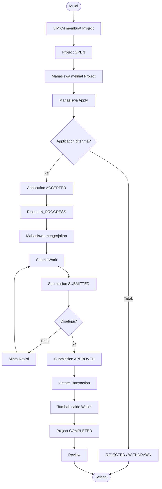
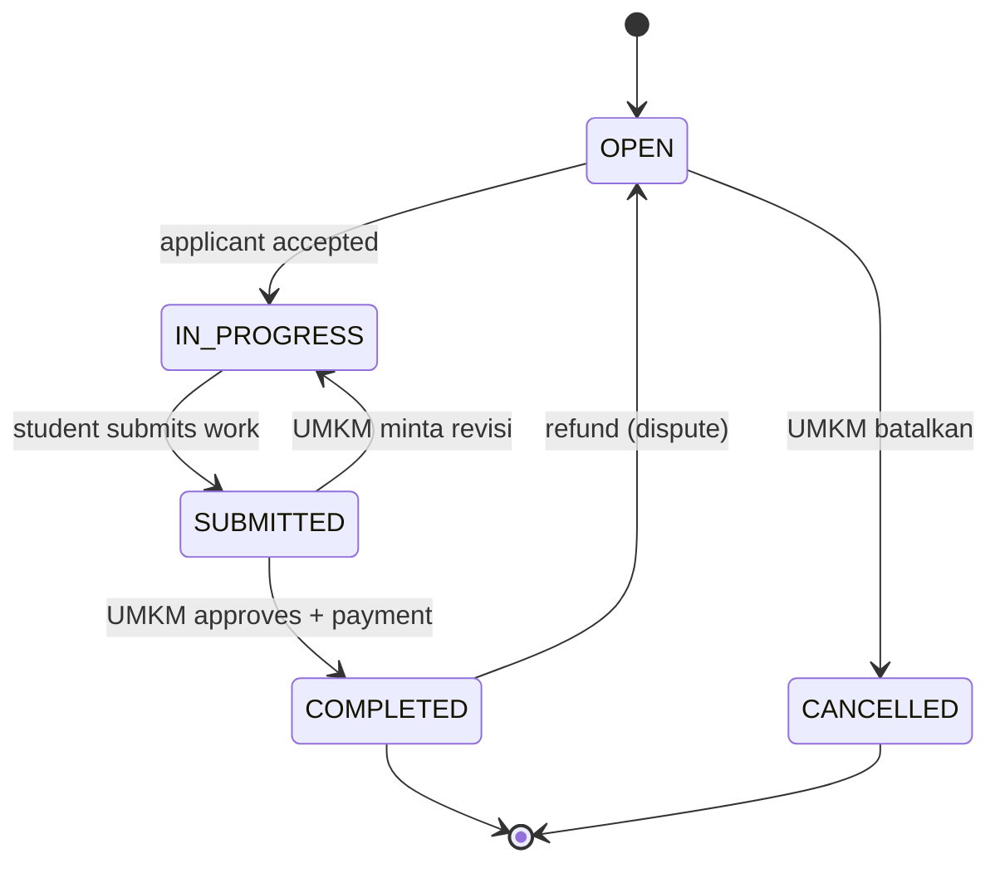

# KIVU
## Marketplace Micro-Freelance Mahasiswa × UMKM
### Materi Presentasi Lomba — Slide Deck + Narasi

---

# Slide 1 — Opening

<p align="center">
  
</p>

# KIVU

**Marketplace Micro-Freelance Mahasiswa × UMKM**

Platform yang mempertemukan mahasiswa/talent dengan UMKM untuk mengerjakan proyek atau tugas berbayar — end-to-end dari posting sampai dibayar.

| Layer | Teknologi |
|---|---|
| Framework | Laravel 13 |
| Bahasa | PHP 8.3+ |
| Frontend | Blade + Livewire 4 |
| CSS / Build | Tailwind v4 + Vite 8 |
| Database | MySQL 8 (Eloquent) |

> **Narasi (30–45 detik):** Selamat pagi/siang. Perkenalkan, ini KIVU — platform yang menghubungkan mahasiswa yang butuh penghasilan dari skill-nya dengan UMKM yang butuh bantuan untuk tugas-tugas sederhana. Bukan sekadar website katalog, tapi marketplace yang nyata: proyek bisa dibuat, dilamar, dikerjakan, dibayar, dan selesai. Data semuanya tersimpan dan berubah sungguhan. Saya akan tunjukkan cara kerjanya.

---

# Slide 2 — Problem & Goals

## Masalah

- Mahasiswa sulit menemukan pekerjaan micro-freelance yang cocok dengan skill-nya.
- UMKM kesulitan mengakses talent mahasiswa untuk tugas/proyek sederhana.
- Belum ada workflow yang menghubungkan proyek → lamaran → hasil → pembayaran dalam satu alur yang jelas.
- Kedua pihak butuh **rasa aman**: siapa yang kredibel, dan jalur penyelesaian bila ada masalah.

## Tujuan

- Membuktikan satu transaksi micro-freelance **berjalan utuh** dari posting sampai selesai.
- Pengalaman yang meyakinkan untuk Mahasiswa, UMKM, dan Admin.
- UI yang proper, konsisten, responsif, **demo-ready**.
- Menampilkan **state/data aktual** di setiap tahap — bukan halaman statis.
- Membangun kepercayaan lewat verifikasi, reputasi, dan transparansi status.

> **Narasi (30 detik):** Masalah utamanya: mahasiswa butuh pekerjaan, UMKM butuh talent, tapi keduanya belum saling terhubung. Lebih dari itu, keduanya butuh rasa aman. KIVU hadir untuk menjawab itu — dengan alur transaksi yang jelas, dashboard per role, dan lapisan kepercayaan seperti verifikasi dan sengketa.

---

# Slide 3 — Target Users & 3 Role

## Empat pihak yang terlibat

| Role | Tujuan | Kemampuan Inti |
|---|---|---|
| **Mahasiswa / Talent** | Menemukan proyek & berpenghasilan | Peluang, melamar, kirim hasil/revisi, dompet, tarik saldo, verifikasi KTM, portofolio, sengketa |
| **UMKM** | Mendapat bantuan talent | Buat/edit/batalkan proyek, kelola pelamar, tinjau hasil, setujui & bayar, ulasan, sengketa |
| **Admin** | Keamanan & operasional | Dashboard metrik, verifikasi KTM, suspend, moderasi proyek, transaksi, penarikan, sengketa |

## Aturan aktivasi akun

- **UMKM** → aktif langsung saat daftar.
- **Mahasiswa email `.ac.id`** → aktif & **terverifikasi otomatis**.
- **Mahasiswa email lain** (mis. `@gmail.com`) → status `pending_ktm` sampai unggah KTM dan diverifikasi admin.

> **Narasi (45 detik):** KIVU punya tiga role. Mahasiswa bisa cari proyek, melamar, kirim hasil, dan tarik uang lewat dompet. UMKM membuat proyek, memilih pelamar, dan membayar. Admin menjaga platform. Hal menarik: kepercayaan dimulai sejak pendaftaran — mahasiswa yang pakai email kampus langsung terverifikasi, yang lain harus buktikan status lewat KTM sebelum dianggap terverifikasi.

---

# Slide 4 — Golden Path

## Satu transaksi lengkap: Posting → Lamar → Terima → Kirim → Setujui → Bayar → Selesai



| Tahap | Status Proyek | Detail |
|---|---|---|
| Posting | OPEN | UMKM buat proyek |
| Lamar | PENDING | Mahasiswa apply |
| Terima | IN_PROGRESS | UMKM terima 1 pelamar |
| Kirim | SUBMITTED | Mahasiswa kirim hasil |
| Setujui | APPROVED | UMKM setujui hasil |
| Bayar | COMPLETED | transaksi dicatat, wallet bertambah |
| Selesai | COMPLETED | proyek selesai + ulasan |

> **Narasi (60 detik — slide terpenting):** Ini jantungnya KIVU, alur yang meniru e-commerce tapi untuk jasa. UMKM buat proyek, statusnya OPEN. Mahasiswa melihat dan melamar. UMKM menerima — hanya satu pelamar per proyek. Mahasiswa mengerjakan dan mengirim hasil. UMKM bisa setujui atau minta revisi. Bila disetujui, sistem otomatis mencatat transaksi, saldo masuk ke dompet mahasiswa, dan proyek selesai. Dari sini muncul ulasan. Intinya: status bergerak satu arah, konsisten, dan tersimpan di database — tidak hilang saat halaman di-refresh.

---

# Slide 5 — State Machine

Pantauan status setiap entitas — semuanya transparan di sisi kedua belah pihak.

## Proyek



## Entitas lain

| Entitas | Alur status |
|---|---|
| **Lamaran** | `PENDING → ACCEPTED \| REJECTED \| WITHDRAWN` (bisa lamar ulang setelah `WITHDRAWN`) |
| **Submission** | `SUBMITTED → APPROVED`, atau `SUBMITTED → REVISION → SUBMITTED` |
| **Penarikan** | `PENDING → APPROVED \| REJECTED \| CANCELLED` |
| **Transaksi** | type: `payment \| withdrawal \| refund` |

> **Narasi (45 detik):** Transparansi berjalan dari cara kita melacak status. Persis seperti kargo yang statusnya bisa dicek, di KIVU setiap proyek, lamaran, dan hasil punya status yang bisa dilihat kedua pihak secara real-time. Ada jalur utama, ada cabang — misalnya revisi yang mengembalikan proyek ke tahap pengerjaan, atau pembatalan. Konsistensi status ini yang membuat data tetap akurat walau di-refresh.

---

# Slide 6 — Arsitektur Teknis

## Stack lengkap

| Layer | Teknologi |
|---|---|
| Application | Laravel 13 |
| Language | PHP 8.3+ (berjalan di 8.5) |
| Frontend | Blade + Livewire 4 |
| CSS | Tailwind CSS v4 |
| Build | Vite 8 |
| Database | MySQL 8 |
| ORM | Eloquent |
| Auth / Autoriasi | Auth Laravel + Middleware + Gate/Policy |
| Storage | Laravel Filesystem (KTM privat, portofolio publik) |
| Payment | Simulasi (MVP) |

## Alur request

```
User
  ↓
Laravel Route (auth + role middleware)
  ↓
Middleware / Authorization (Policy/Gate)
  ↓
Livewire / Controller
  ↓
Service / DB Transaction (+ lockForUpdate)
  ↓
Eloquent Model
  ↓
MySQL
```

> **Narasi (45 detik):** Secara teknis KIVU dibangun di atas Laravel 13 dan Livewire untuk UI yang reaktif tanpa perlu JavaScript kompleks. Satu excel di sini: otorisasi diperiksa berlapis — bukan sekadar menyembunyikan tombol di layar, tapi ditegakkan di backend lewat middleware dan policy. Dan operasi yang menyentuh uang memakai database transaction dengan kunci lock, supaya tidak mungkin dobel-bayar atau saldo hilang.

---

# Slide 7 — Kunci: Data-Driven & Aturan Bisnis

## Data-driven UI

- UI menampilkan **state & data aktual**, bukan sekadar pindah halaman.
- Perubahan status konsisten di sisi Mahasiswa dan UMKM.
- Data tetap konsisten setelah refresh.

## Aturan bisnis penting

- Proyek baru selalu `OPEN`; hanya `OPEN` yang bisa menerima lamaran.
- Maksimal **satu** pelamar diterima per proyek.
- Hanya mahasiswa `ACCEPTED` yang boleh mengirim hasil.
- Approval memicu transaksi pembayaran → saldo wallet → proyek `COMPLETED`.
- Withdrawal ditolak → saldo **dikembalikan**, tidak hilang.
- Pembatalan proyek `OPEN` → semua lamaran `PENDING` otomatis ditolak.
- Otorisasi di backend: akses bukan kewenangan → **403**.

> **Narasi (45 detik):** Ada dua hal yang membuat solusi ini kuat. Pertama, UI tidak bohong — yang ditampilkan adalah data dan status sungguhan dari database, bukan animasi semata. Kedua, aturan bisnis ditegakkan di level sistem. Misalnya, tidak mungkin dua orang ambil proyek yang sama, dan uang yang gagal ditarik otomatis kembali ke dompet. Ini mencegah kecurangan dan menjaga integritas transaksi.

---

# Slide 8 — Keamanan

Kontrol keamanan yang diimplementasikan (detail: `security.md`):

| No | Kontrol | Fungsi |
|---|---|---|
| 1 | **Password hashing** | kata sandi tersimpan aman |
| 2 | **Sesi aman** | melindungi sesi login |
| 3 | **Rate limit** (`throttle:10,1`) | proteksi brute-force login/daftar |
| 4 | **Otorisasi berlapis** | middleware + Policy/Gate → 403 |
| 5 | **Anti-XSS** | escaping & validasi input |
| 6 | **CSRF** | cegah serangan lintas-situs |
| 7 | **Anti-SQLi** | ORM Eloquent |
| 8 | **Upload aman + file privat** | KTM privat, batas JPG/PNG/PDF ≤4MB |
| 9 | **Operasi atomik** | anti dobel-bayar / saldo hilang |

> **Narasi (40 detik):** Karena KIVU memegang data pengguna dan uang, keamanan bukan opsional. Ada otorisasi berlapis, perlindungan brute-force dengan rate limit, esciming input untuk mencegah XSS dan SQL injection, serta file sensitif seperti KTM disimpan privat. Yang terpenting untuk platform uang: setiap transaksi bersifat atomik — sistem tidak bisa mencatat atau menarik dana dua kali sekaligus.

---

# Slide 9 — Lapisan Kepercayaan

Di atas alur inti, ada lapisan kepercayaan yang membedakan KIVU dari papan iklan biasa.

## Verifikasi KTM

- Mahasiswa unggah kartu tanda mahasiswa.
- Email `.ac.id` → terverifikasi otomatis.
- Email lain → diverifikasi admin.
- Tampil **lencana "Mahasiswa Terverifikasi"**.

## Reputasi & Profil Publik

- Rating & ulasan tampil di profil.
- Bio, keahlian (skill), portofolio (maks 12 item, file/URL).
- Profil publik bisa dilihat UMKM sebelum menerima pelamar.
- Mahasiswa `pending_ktm` tetap boleh bekerja (warning lembut) — transparan, tidak menghalangi.

> **Narasi (45 detik):** Di dunia freelance online, masalah terbesar adalah "apakah orang ini bisa dipercaya?". KIVU menjawabnya lewat tiga hal: verifikasi identitas lewat KTM yang ditandai lencana, reputasi dari rating dan ulasan setelah proyek selesai, dan profil publik yang menampilkan portofolio. Jadi UMKM bisa menilai mahasiswa sebelum memutuskan menerima lamaran.

---

# Slide 10 — Tata Kelola & Sengketa

Bila terjadi masalah, ada jalur penyelesaian — tidak ada yang jalan sendiri.

## Moderasi (Admin)

- **Takedown** proyek bermasalah (non-COMPLETED).
- **Suspend / aktifkan** akun.

## Penarikan saldo

- Mahasiswa tarik saldo ke rekening.
- Admin setujui/tolak; status jelas; saldo kembali bila ditolak/dibatalkan.

## Sengketa

- Bisa dibuka pada proyek `IN_PROGRESS`, `SUBMITTED`, atau `COMPLETED`.
- Maksimal **satu** sengketa OPEN per pelapor per proyek.
- Admin memutuskan:
  - **Refund** → dana dibalikkan (bila sudah dibayar), proyek dibuka kembali.
  - **Release** → submission disetujui & dibayar (hanya bila belum dibayar).
- Pelapor bisa membatalkan selama sengketa OPEN.

> **Narasi (45 detik):** Transaksi digital butuh jaring pengaman. Kalau ada perselisihan — misalnya hasil tidak sesuai atau UMKM tidak membayar — sengketa bisa diajukan. Admin lalu memutuskan: me-refund dana ke mahasiswa, atau me-release pembayaran. Ini memberi rasa aman bagi kedua belah pihak dan menjadi nilai jual utama KIVU.

---

# Slide 11 — Fitur Chat

Komunikasi dua arah di dalam satu proyek — tidak tersebar di medsos.

- Chat **per proyek**: satu thread = satu proyek.
- Dilayani untuk **Mahasiswa ↔ UMKM** (student - aplikasi/submission, UMKM - owner).
- **Refresh berkala** tiap 20 detik (Livewire polling).
- **Read receipt**: pesan dibaca ditandai, ada badge belum-dibaca di daftar thread.
- Indikator siapa yang belum membaca, avatar, status proyek di header percakapan.

> **Narasi (40 detik):** Diskusi kerja sering tersebar di WhatsApp atau email yang tidak nyambung dengan datanya proyek. KIVU punya chat bawaan yang dilingkupi per proyek, sehingga mahasiswa dan UMKM bisa berdiskusi sambil melihat status proyek. Ada tanda sudah-dibaca dan badge pesan baru. Versi sekarang pakai pembaruan berkala; ke depan kami siapkan WebSocket agar real-time.

---

# Slide 12 — Roadmap & Fitur 30% Offline

Tahap selanjutnya — rencana pengembangan menuju produk yang lebih lengkap.

| Fitur | Deskripsi |
|---|---|
| **Real-time Chat & Notifikasi** | WebSocket ini chat tanpa refresh + push notification |
| **Escrow & Payment Gateway** | Integrasi Midtrans/Xendit untuk keamanan dana otomatis |
| **AI Job Recommendation** | Pencocokan proyek otomatis dengan skill mahasiswa |
| **Advanced Analytics** | Visualisasi performa ekonomi UMKM, portofolio progresif mahasiswa |
| **Project Milestones** | Pembayaran bertahap untuk proyek skala menengah/besar |

> **Narasi (30 detik):** KIVU kami rancang untuk tumbuh. Fitur-chat saat ini sudah jalan dengan refresh berkala — fondasi kami siapkan untuk diubah ke real-time dengan WebSocket. Berikutnya: integrasi escrow dan payment gateway untuk keamanan dana lebih riil, rekomendasi proyek berbasis AI, analitik, dan pembayaran bertahap untuk proyek besar.

---

# Slide 13 — Skenario Demo 5 Menit

## Akun demo

| Role | Email | Password |
|---|---|---|
| Admin | `admin@kivu.id` | `password` |
| UMKM | `umkm@kivu.id` | `password` |
| Mahasiswa | `talent@kivu.id` | `password` |

## Langkah demo

1. **UMKM** login → buat proyek (mis. "Desain Logo") → status `OPEN`.
2. **Mahasiswa** login → temukan proyek → **lamar**.
3. **UMKM** terima mahasiswa → proyek `IN_PROGRESS`.
4. **Mahasiswa** kirim hasil → `SUBMITTED`.
5. *(Opsional)* UMKM minta revisi → mahasiswa kirim ulang.
6. **UMKM** setujui hasil & beri ulasan.
7. **Dompet mahasiswa** tunjukkan saldo & riwayat transaksi.
8. **Admin** buka panel → periksa transaksi / sengketa / penarikan.

> **Narasi (45 detik):** Sekarang saya perlihatkan bagaimana juri sendiri bisa mencobanya dalam 5 menit. Tiga akun demo tersedia — admin, UMKM, dan mahasiswa. Juri tinggal: UMKM buat proyek, mahasiswa melamar, UMKM terima, mahasiswa kirim hasil, UMKM setujui & bayar, lalu dompet mahasiswa otomatis bertambah. Admin bisa memantau semua dari panel. Alurnya bisa selesai tanpa bantuan developer.

---

# Slide 14 — Acceptance Criteria

Kriteria keberhasilan yang menjadi ukuran demo KIVU.

- Juri dapat menyelesaikan golden path **tanpa bantuan developer**.
- Perubahan status **konsisten** di sisi Mahasiswa dan UMKM.
- Data tetap konsisten **setelah refresh**.
- Role tidak bisa mengakses aksi bukan kewenangannya → **403**.
- Tidak ada blocker pada login, create project, apply, accept, submit, approve, wallet.
- Aksi berbahaya dilindungi **konfirmasi**.
- UI terlihat sebagai **satu produk yang konsisten**.
- Demo selesai ±5 menit memakai akun demo.

> **Narasi (30 detik):** Ini tolok ukur keberhasilan kami. Yang kami yakinkan: alur utama bisa diselesaikan siapa saja tanpa instruksi, status konsisten di semua sisi, data aman saat di-refresh, otorisasi tidak bisa ditembus, dan seluruh tampilan terasa sebagai satu produk yang utuh, bukan kumpulan halaman acak.

---

# Slide 15 — Penutup

## KIVU — satu kalimat

> Platform micro-freelance yang menghubungkan **mahasiswa** dan **UMKM** lewat alur transaksi yang **end-to-end**, **transparan**, dan **dapat dipercaya**.

## Nilai utama

- **End-to-end**: posting → lamar → kerjakan → bayar → selesai.
- **Data-driven**: status & data nyata, konsisten setelah refresh.
- **Kepercayaan**: verifikasi KTM, reputasi, portofolio.
- **Tata kelola**: sengketa, moderasi, penarikan.
- **Demo-ready**: siap dibuktikan sekarang, bisa tumbuh ke arah escrow, chat real-time, dan AI.

## Terima kasih

Siap menerima pertanyaan.

> **Narasi (30 detik):** Menutup dengan satu kalimat: KIVU adalah platform yang mempertemukan mahasiswa dan UMKM dengan alur transaksi yang utuh, transparan, dan bisa dipercaya. Bukan sekadar konsep — sudah berjalan, bisa didemo sekarang, dan dirancang untuk berkembang baik ke escrow, obrolan real-time, maupun rekomendasi AI. Terima kasih, saya siap menerima pertanyaan.