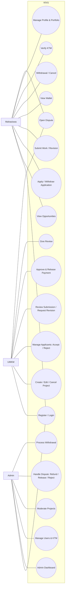
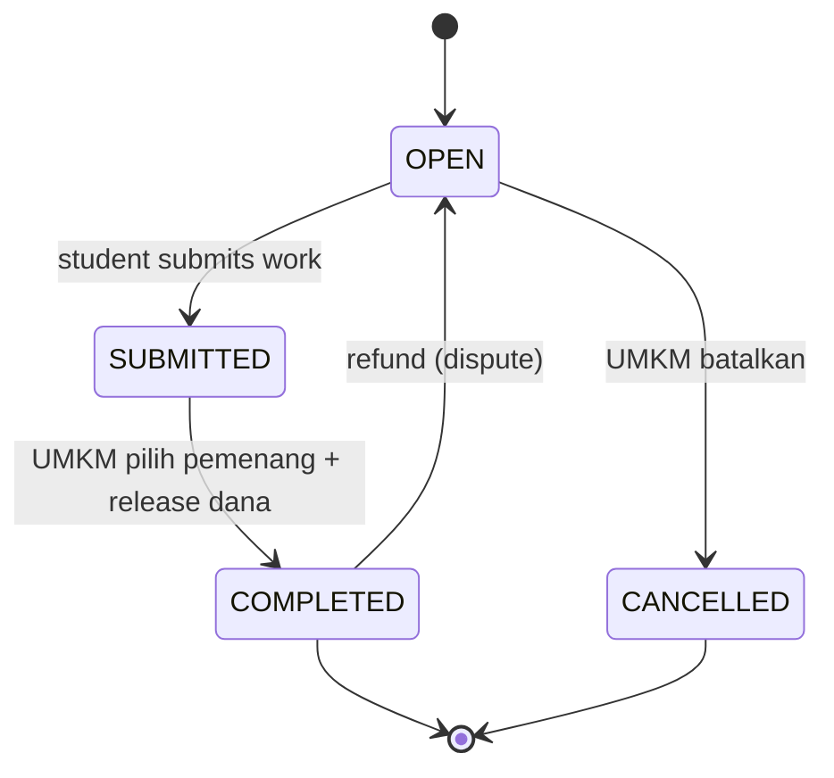
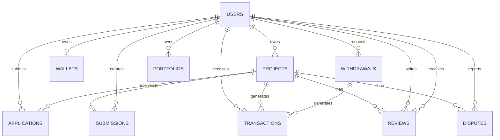
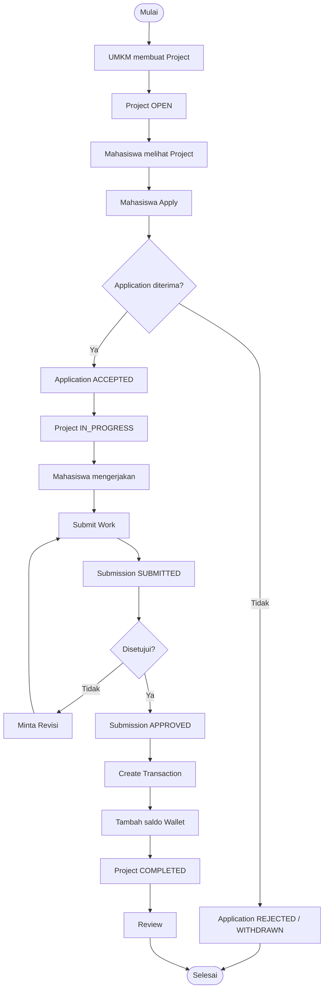

KIVU
PRODUCT REQUIREMENTS DOCUMENT
Platform Micro-Freelance Mahasiswa × UMKM
Versi 2.0 (Revisi Implementasi) • 14 September 2026

# Dokumen Source of Truth

Dokumen ini merupakan single source of truth untuk pengembangan KIVU. Seluruh keputusan produk, alur pengguna, use case, business rules, database, arsitektur, UI/UX, acceptance criteria, keamanan, dan aturan pengembangan dikonsolidasikan di dalam dokumen ini.

Versi 2.0 menyelaraskan dokumen dengan **implementasi terkini** yang telah berjalan (termasuk fitur di luar MVP awal: verifikasi KTM, revisi submission, sengketa, pembatalan, portofolio, profil publik, dan pengerasan keamanan).

## Changelog

| Versi | Tanggal | Perubahan utama |
| --- | --- | --- |
| 1.0 | 14 Sep 2026 | PRD awal MVP. |
| 2.0 | 14 Sep 2026 | Selaras implementasi: stack aktual (Laravel 13, Livewire 4, MySQL 8, Tailwind 4); status per requirement; entitas `disputes` & `portfolios`; status baru (`WITHDRAWN`, `REVISION`, `CANCELLED`); verifikasi KTM + lencana; revisi submission; sengketa & refund/release; edit/batalkan proyek; tolak pelamar; profil publik & reputasi; keamanan (`security.md`). |

# 1. Ringkasan Produk

KIVU adalah platform marketplace micro-freelance yang mempertemukan mahasiswa/talent dengan UMKM untuk mengerjakan proyek atau tugas berbayar. Alur inti berjalan end-to-end: UMKM membuat proyek, mahasiswa melamar, UMKM menerima pelamar, mahasiswa mengirim hasil, UMKM menyetujui, pembayaran dicatat ke wallet mahasiswa, dan proyek selesai.

KIVU bukan kumpulan halaman statis: data dan status berubah nyata, tersimpan di database, dan tetap konsisten setelah refresh. Di atas alur inti, tersedia lapisan **kepercayaan** (verifikasi KTM, reputasi/ulasan, portofolio, profil publik) dan **tata kelola** (sengketa, moderasi, penarikan saldo).

# 2. Problem & Goals

## 2.1 Problem

- Mahasiswa membutuhkan cara sederhana menemukan pekerjaan micro-freelance sesuai skill.
- UMKM membutuhkan akses ke talent mahasiswa untuk tugas/proyek sederhana.
- Platform membutuhkan workflow jelas yang menghubungkan project, application, submission, approval, dan pembayaran.
- Kedua pihak membutuhkan **rasa aman/percaya** (siapa yang kredibel) dan **jalur penyelesaian** bila terjadi masalah.

## 2.2 Goals

- Membuktikan satu transaksi micro-freelance berjalan dari posting sampai selesai.
- Memberikan pengalaman meyakinkan untuk Mahasiswa, UMKM, dan Admin.
- Menyediakan UI proper, konsisten, responsif, dan demo-ready.
- Menampilkan state/data aktual di setiap tahap workflow.
- Membangun kepercayaan lewat verifikasi, reputasi, dan transparansi status.

# 3. Target Users & Roles

| Role | Tujuan | Kemampuan |
| --- | --- | --- |
| Mahasiswa / Talent | Menemukan proyek dan memperoleh penghasilan dari skill. | Peluang, detail proyek, melamar (batalkan/lamar ulang), kirim hasil & revisi, dompet, penarikan (batalkan), unggah KTM, profil & portofolio, mengajukan sengketa. |
| UMKM | Mendapatkan bantuan talent untuk proyek/tugas. | Buat/edit/batalkan proyek, kelola pelamar (terima/tolak), tinjau hasil, setujui & bayar, minta revisi, beri ulasan, mengajukan sengketa, profil. |
| Admin | Menjaga keamanan dan operasional platform. | Dashboard metrik, kelola pengguna (verifikasi/batalkan KTM, suspend), moderasi proyek, transaksi, penarikan, sengketa. |

**Registrasi & aktivasi:**
- UMKM: **aktif langsung** saat pendaftaran.
- Mahasiswa email **.ac.id**: aktif & **terverifikasi otomatis**.
- Mahasiswa email lain (mis. @gmail.com): status **pending_ktm** sampai mengunggah KTM dan diverifikasi admin.

# 4. Product Principles

- Simple first — prioritaskan transaksi inti.
- Trust by workflow — status, submission, approval, pembayaran, dan ulasan harus jelas.
- Trust by identity — verifikasi mahasiswa, reputasi, dan portofolio tampil transparan.
- Role-based experience — tiap role hanya melihat aksi relevan.
- Data-driven UI — UI menampilkan state/data aktual, bukan sekadar pindah halaman.
- Demo-ready — golden path dapat dijalankan memakai akun demo.
- Single source of truth — requirement dan aturan tidak boleh dilanggar implementasi.

# 5. User Flow

## 5.1 Visitor

Landing → Register → pilih Mahasiswa/UMKM → isi nama/email/password → masuk.
Mahasiswa `.ac.id` aktif & terverifikasi otomatis; mahasiswa non-`.ac.id` perlu unggah KTM di halaman Profil agar diverifikasi admin. UMKM aktif langsung.

## 5.2 Mahasiswa

Login → Dashboard → Peluang → Detail Proyek → Lamar → Kirim Hasil → (opsional: jika jadi pemenang & diminta Revisi → kirim ulang) → menunggu rilis → Dompet → Tarik Saldo.
Tambahan: verifikasi KTM (Profil), kelola bio/skill & portofolio, batalkan lamaran, batalkan penarikan, ajukan sengketa.

## 5.3 UMKM

Login → Dashboard → Buat Proyek → isi judul/deskripsi/budget → Post (OPEN) → Proyek Saya → lihat hasil masuk → **Pilih Pemenang** → tinjau hasil pemenang → Rilis Dana **atau** Minta Revisi (pemenang) → beri Review.
Tambahan: edit/batalkan proyek (selama OPEN), lihat profil/reputasi pelamar, ajukan sengketa, profil.

## 5.4 Admin

Login → Panel Admin → Dashboard → Pengguna → Proyek → Transaksi → Penarikan → Sengketa.
Aksi: verifikasi/batalkan KTM, suspend/aktifkan pengguna, moderasi (takedown) proyek, setujui/tolak penarikan, proses sengketa (Refund/Release/Tolak).

# 6. Use Case

## 6.1 Use Case Diagram



## 6.2 Use Case Rules

- Mahasiswa: tidak boleh menerima pelamar, menyetujui/membayar submission, atau mengelola proyek UMKM.
- UMKM: hanya dapat mengelola proyek miliknya sendiri.
- Admin: mengakses fungsi operasional sesuai permission.
- Semua role: tidak boleh mengakses route/aksi role lain tanpa otorisasi. (Ditegakkan middleware + Policy/Gate; pelanggaran → 403.)

# 7. Golden Path MVP

Posting → Lamar → Kirim Hasil → Pilih Pemenang → Rilis Dana → Selesai

| Tahap | Aktor | Output | Status |
| --- | --- | --- | --- |
| Posting | UMKM | Project dibuat | OPEN |
| Lamar | Mahasiswa | Application dibuat | PENDING |
| Kirim Hasil | Mahasiswa | Banyak submission masuk | OPEN / SUBMITTED |
| Pilih Pemenang | UMKM | Pemenang ACCEPTED, lain REJECTED | SUBMITTED |
| Rilis Dana | UMKM | Transaction dibuat; saldo pemenang bertambah | COMPLETED |
| Selesai | Sistem/UMKM | Proyek selesai; dapat review | COMPLETED |

# 8. Functional Requirements

Kolom **Status** mencerminkan implementasi saat ini: ✅ selesai, ◐ sebagian.

## Authentication

| ID | Requirement | Prioritas | Acceptance | Status |
| --- | --- | --- | --- | --- |
| AUTH-01 | Registrasi role Mahasiswa/UMKM | P0 | Role tersimpan dan menentukan dashboard. | ✅ |
| AUTH-02 | Login email/password | P0 | Login valid masuk dashboard role yang benar. | ✅ |
| AUTH-03 | Admin login | P0 | Admin masuk panel admin. | ✅ |
| AUTH-04 | Aktivasi `.ac.id` langsung; email lain perlu KTM | P1 | Mahasiswa `.ac.id` terverifikasi otomatis, lainnya upload KTM. | ✅ |
| AUTH-05 | Role-protected routes/actions | P0 | User tidak dapat mengakses aksi role lain (403). | ✅ |
| AUTH-06 | Proteksi brute-force login/daftar | P1 | Rate limit `throttle:10,1`. | ✅ |
| AUTH-07 | Suspend akun | P1 | Akun suspended tidak bisa login & diblokir. | ✅ |
| AUTH-08 | Ganti nama/password | P1 | Wajib password lama; email tidak dapat diubah. | ✅ |

## Mahasiswa

| ID | Requirement | Prioritas | Acceptance | Status |
| --- | --- | --- | --- | --- |
| STU-01 | Melihat Opportunities (OPEN) | P0 | Project OPEN tampil + pencarian/filter/sort. | ✅ |
| STU-02 | Melihat Project Detail | P0 | Judul, deskripsi, budget, pemilik, tanggal. | ✅ |
| STU-03 | Apply project | P0 | Application PENDING, tidak duplikat. | ✅ |
| STU-04 | Melihat status application | P0 | Status jelas (PENDING/ACCEPTED/REJECTED/WITHDRAWN). | ✅ |
| STU-05 | Submit Work selagi proyek aktif | P0 | Submission SUBMITTED (semua pelamar; 1 aktif/mahasiswa). | ✅ |
| STU-06 | Melihat Wallet | P1 | Saldo, pendapatan, histori transaksi. | ✅ |
| STU-07 | Withdrawal | P1 | Penarikan tercatat dengan status jelas. | ✅ |
| STU-08 | Verifikasi KTM | P1 | Unggah KTM; admin verifikasi; lencana terverifikasi. | ✅ |
| STU-09 | Batalkan lamaran (PENDING) | P1 | Status WITHDRAWN; dapat melamar ulang. | ✅ |
| STU-10 | Kirim revisi hasil | P1 | Setelah UMKM minta revisi (REVISION). | ✅ |
| STU-11 | Batalkan penarikan (PENDING) | P1 | Status CANCELLED; saldo dikembalikan. | ✅ |
| STU-12 | Ajukan & batalkan sengketa | P1 | Sengketa OPEN; pelapor dapat membatalkan. | ✅ |
| STU-13 | Profil: bio, skill, portofolio | P1 | CRUD portofolio (file/URL), bio & keahlian. | ✅ |
| STU-14 | Reputasi | P1 | Rating & ulasan diterima tampil di profil. | ✅ |

## UMKM

| ID | Requirement | Prioritas | Acceptance | Status |
| --- | --- | --- | --- | --- |
| BUS-01 | Create Project | P0 | Judul, deskripsi, budget; status OPEN. | ✅ |
| BUS-02 | My Projects | P0 | Dikelompokkan per status. | ✅ |
| BUS-03 | Melihat applicants | P0 | Applicant, status, reputasi terlihat. | ✅ |
| BUS-04 | Melihat semua submission & pilih pemenang | P0 | Pemenang ACCEPTED, lain REJECTED; proyek menunggu review. | ✅ |
| BUS-05 | Melihat submission | P0 | Hasil dapat ditinjau. | ✅ |
| BUS-06 | Approve & release dana | P0 | Submission pemenang APPROVED; payment dicatat. | ✅ |
| BUS-07 | Give review | P1 | Review tersimpan setelah selesai. | ✅ |
| BUS-08 | Reject applicant | P1 | Status REJECTED + catatan alasan. | ✅ |
| BUS-09 | Minta revisi (pemenang) | P1 | Submission REVISION + catatan. | ✅ |
| BUS-10 | Edit proyek (OPEN) | P1 | Ubah judul/deskripsi/budget. | ✅ |
| BUS-11 | Batalkan proyek (OPEN) | P1 | Status CANCELLED; lamaran PENDING otomatis ditolak. | ✅ |
| BUS-12 | Ajukan & batalkan sengketa | P1 | Sengketa OPEN; pelapor dapat membatalkan. | ✅ |
| BUS-13 | Profil UMKM | P1 | Ubah nama/password. | ✅ |

## Admin

| ID | Requirement | Prioritas | Acceptance | Status |
| --- | --- | --- | --- | --- |
| ADM-01 | Dashboard | P0 | Metrik user/proyek/pembayaran bersih/penarikan/KTM/sengketa. | ✅ |
| ADM-02 | Suspend/aktifkan user | P1 | Status berubah & akses dibatasi; status pra-suspend dipulihkan. | ✅ |
| ADM-03 | Moderasi proyek | P1 | Takedown proyek (bukan COMPLETED). | ✅ |
| ADM-04 | Handle dispute | P1 | Refund / Release / Tolak. | ✅ |
| ADM-05 | Approve/reject withdrawal | P1 | Status tercatat + jejak transaksi. | ✅ |
| ADM-06 | Verifikasi/batalkan KTM | P1 | Setujui/batalkan verifikasi mahasiswa. | ✅ |

# 9. Business Rules

- BR-01. Project baru selalu `OPEN`.
- BR-02. Hanya project `OPEN` yang dapat menerima application.
- BR-03. Mahasiswa tidak dapat membuat application duplikat pada project yang sama (unique `project_id+student_id`).
- BR-04. Semua pelamar dapat mengirim hasil kerja selagi proyek `OPEN`/`SUBMITTED`. UMKM memilih **satu pemenang** dari hasil yang masuk; pemenang menjadi `ACCEPTED`, lamaran lain `REJECTED`.
- BR-05. Hanya mahasiswa dengan lamaran aktif (`PENDING`/`ACCEPTED`) yang dapat membuat submission, dan hanya satu submission aktif (non-revisi) per mahasiswa per proyek.
- BR-06. Submission yang dikirim berstatus `SUBMITTED`.
- BR-07. UMKM dapat menyetujui submission pemenang valid (`APPROVED`) **atau** meminta revisi (`REVISION` + catatan). Revisi hanya untuk pemenang (`ACCEPTED`).
- BR-08. Approval memicu pencatatan transaction pembayaran sebesar **bid pemenang** (fallback budget).
- BR-09. Transaction pembayaran menambah saldo wallet mahasiswa pemenang.
- BR-10. Setelah pembayaran dicatat, project menjadi `COMPLETED`.
- BR-11. Withdrawal harus berstatus dan diproses sesuai kewenangan Admin; saldo tidak boleh hilang bila ditolak (dikembalikan).
- BR-12. User hanya mengubah data yang menjadi kewenangannya.
- BR-13. Semua perubahan state penting dilakukan atomik dan tidak rusak karena refresh.
- BR-14. Payment gateway produksi dan escrow bank bukan requirement P0.
- BR-15. Mahasiswa `pending_ktm` **tetap boleh** melamar/mengirim hasil (diberi peringatan lembut), namun lencana "Mahasiswa Terverifikasi" hanya muncul setelah verifikasi.
- BR-16. Melamar ulang diperbolehkan setelah lamaran `WITHDRAWN` (baris lamaran direset ke `PENDING`).
- BR-17. Sengketa dapat dibuka pada proyek `IN_PROGRESS`, `SUBMITTED`, atau `COMPLETED`; maksimal **satu sengketa OPEN per pelapor per proyek**.
- BR-18. Penyelesaian sengketa: **Refund** (dana dibalikkan bila sudah dibayar; proyek dibuka kembali, **semua** submission dihapus & **semua** lamaran direset ke `PENDING`) atau **Release** (submission pemenang disetujui & dibayar); Release hanya bila belum dibayar.
- BR-19. Pembatalan proyek `OPEN` otomatis menolak semua lamaran `PENDING` proyek tersebut.
- BR-20. Portofolio publik maksimal 12 item per mahasiswa; file dibatasi JPG/PNG/PDF ≤ 4MB.
- BR-21. Berkas hasil kerja disimpan **privat** dan hanya dapat diunduh melalui rute ber-otorisasi (pemilik submission, pemilik proyek, admin).
- BR-22. Pemenang dipilih dalam **dua tahap**: UMKM memilih (`ACCEPTED`, lain `REJECTED`) lalu mereview/merilis dana; proyek selesai (`COMPLETED`) hanya setelah **Release**.

# 10. State Machine

## 10.1 Project

`OPEN → SUBMITTED → COMPLETED`; `OPEN → CANCELLED`; `COMPLETED` dapat kembali `OPEN` melalui **Refund** sengketa.


> Catatan: `IN_PROGRESS` tidak lagi digunakan sebagai tahap alur inti pada model kontes terbuka (seluruh pelamar langsung mengirim hasil selagi `OPEN`/`SUBMITTED`).

## 10.2 Application

`PENDING → ACCEPTED | REJECTED | WITHDRAWN` (mahasiswa dapat melamar ulang setelah `WITHDRAWN`). ACCEPTED hanya untuk **pemenang**; REJECTED untuk yang tidak terpilih.

## 10.3 Submission

`(belum ada) → SUBMITTED → APPROVED`; `SUBMITTED → REVISION → SUBMITTED` (kirim ulang, **hanya pemenang**). Banyak mahasiswa dapat memiliki submission pada proyek yang sama (kontes terbuka).

## 10.4 Withdrawal

`PENDING → APPROVED | REJECTED | CANCELLED` (CANCELLED oleh mahasiswa; saldo kembali).

## 10.5 Transaction

`type`: `payment | withdrawal | refund`; `status`: `RECORDED | SUCCESS | REJECTED`.

# 11. Database Design

## 11.1 Entity Utama

| Entity | Field penting | Aturan kunci |
| --- | --- | --- |
| users | id, name, email, password, role, status, status_before_suspend, student_verified_at, ktm_path, business_name, bio, skills(json), timestamps | role: student/umkm/admin; status: active/pending_ktm/suspended |
| projects | id, owner_id, title, description, budget, status, timestamps | owner_id → users; status termasuk CANCELLED |
| applications | id, project_id, student_id, status, message, rejection_note, timestamps | unique(project_id, student_id); status termasuk WITHDRAWN |
| submissions | id, project_id, student_id, file_path, link, note, revision_note, status, timestamps | unique(project_id, student_id); status termasuk REVISION |
| transactions | id, project_id(nullable), withdrawal_id(nullable), student_id, amount, type, status, timestamps | type termasuk refund; status termasuk REJECTED |
| wallets | id, student_id(unique), balance, timestamps | satu wallet per mahasiswa |
| withdrawals | id, student_id, amount, status, bank_name, bank_account, note, timestamps | status termasuk CANCELLED |
| reviews | id, project_id, reviewer_id, reviewee_id, rating, comment, timestamps | reviewer UMKM → reviewee mahasiswa |
| disputes | id, project_id, reporter_id, against_id, reason, description, status, resolution, resolved_by, resolved_at, timestamps | status OPEN/RESOLVED/REJECTED/CANCELLED; resolution refund/release |
| portfolios | id, student_id, title, description, url, file_path, timestamps | maks 12 per mahasiswa |

## 11.2 ERD



# 12. System Architecture

## 12.1 Stack Aktual

| Layer | Teknologi |
| --- | --- |
| Application | Laravel 13 |
| Language | PHP 8.3+ (berjalan 8.5) |
| Frontend | Blade + Livewire 4 |
| CSS | Tailwind CSS v4 |
| Build | Vite 8 |
| Database | MySQL 8 |
| ORM | Eloquent |
| Auth | Laravel Authentication |
| Authorization | Middleware + Gate + Policy |
| Validation | Laravel Validation / Livewire |
| Storage | Laravel Filesystem (KTM privat; portofolio publik) |
| Payment | Simulasi (MVP) |

```text
User
  ↓
Laravel Route (auth + role middleware)
  ↓
Middleware / Authorization (Policy/Gate)
  ↓
Livewire / Controller
  ↓
Service / DB Transaction (+ lockForUpdate)
  ↓
Eloquent Model
  ↓
MySQL
```

## 12.2 Aturan Arsitektur

- Gunakan Eloquent relationships.
- Otorisasi ditegakkan di backend (middleware/policy), bukan hanya menyembunyikan tombol.
- Business logic tidak diletakkan di Blade.
- Operasi pembayaran/penarikan/sengketa memakai database transaction + lock (atomik).
- Gunakan seeder/factory untuk akun & data demo.
- Jangan membuat API internal untuk kebutuhan frontend.
- Data sensitif disimpan privat; akses lewat rute ber-otorisasi.

## 12.3 Struktur Folder (ringkas)

```text
app/
├── Http/Controllers/   (AuthController, KtmController)
├── Http/Middleware/    (RoleMiddleware)
├── Livewire/
│   ├── Public/         (Landing, TalentProfile)
│   ├── Student/        (Dashboard, Opportunities, ProjectDetail, MyApplications, SubmitWork, Wallet, Profile)
│   ├── Umkm/           (Dashboard, CreateProject, EditProject, MyProjects, ManageApplicants, ReviewSubmission, Profile)
│   └── Admin/          (Dashboard, Users, Projects, Transactions, Withdrawals, Disputes)
├── Models/             (User, Project, Application, Submission, Transaction, Wallet, Withdrawal, Review, Dispute, Portfolio)
├── Policies/           (Application, Project, Submission, Withdrawal, Dispute, User, Portfolio)
└── Services/           (StudentTrust)
```

# 13. UI/UX Specification

- Satu design system (tailwind tokens): tipografi, warna, spacing, radius, tombol, input, card, badge, modal, tabel, feedback.
- Komponen reusable: `<x-ui.pill>`, `<x-ui.status-badge>`, `<x-ui.verified-badge>`, `<x-ui.avatar>`, `<x-ui.stat-card>`, `<x-ui.empty-state>`, `<x-ui.confirm-modal>`, `<x-icon>`.
- Setiap halaman utama punya state loading, empty, validation-error, dan error.
- Vocabulary status konsisten: `OPEN, PENDING, ACCEPTED, REJECTED, WITHDRAWN, IN_PROGRESS, SUBMITTED, APPROVED, REVISION, COMPLETED, CANCELLED`.
- Aksi utama jelas: Lamar, Terima/Tolak, Kirim Hasil, Setujui & Bayar, Minta Revisi, Refund, Release.
- Aksi berbahaya memakai **modal konfirmasi**.
- Layout responsif desktop & mobile.
- UI menampilkan state/data aktual setelah aksi & refresh.

## 13.1 Page Map

- **Public**: Landing, Register, Login, Profil Publik Talent (`/talents/{user}`).
- **Mahasiswa**: Dashboard, Peluang, Detail Proyek, Lamaran/Status, Kirim Hasil, Dompet (+Penarikan), Profil.
- **UMKM**: Dashboard, Buat Proyek, Edit Proyek, Proyek Saya, Pelamar, Tinjau Submission, Profil.
- **Admin**: Dashboard, Pengguna, Proyek, Transaksi, Penarikan, Sengketa.
- **Lain**: Akses KTM (`/ktm/{user}`, privat).

# 14. Flowchart Golden Path



## 14.1 Alternative Flow

- Application rejected/withdrawn: mahasiswa tidak melanjutkan; dapat melamar ulang bila withdrawn.
- Submission diminta revisi: kembali ke tahap submit.
- Proyek dibatalkan UMKM (OPEN): lamaran PENDING otomatis ditolak.
- Withdrawal ditolak/dibatalkan: saldo dikembalikan; status Rejected/Cancelled.
- Sengketa: admin memutuskan Refund atau Release; pelapor dapat membatalkan selama OPEN.
- Unauthorized action: ditolak backend (403).

# 15. Non-Functional Requirements

- Performance: halaman responsif; hindari query berlebih.
- Reliability: state transaksi tetap setelah refresh.
- Security: lihat dokumen khusus **`security.md`** (otorisasi, rate limit, upload aman, PII, atomicitas).
- Accessibility: label form, keyboard, kontras, error feedback.
- Maintainability: fitur modular; logic tidak menumpuk di UI.
- Validation: divalidasi di server/Livewire.
- Data integrity: perubahan multi-tabel (pembayaran, refund, penarikan) memakai database transaction.

# 16. Scope

## 16.1 P0 — Wajib (✅ selesai)

Landing, Register/Login, Role Mahasiswa/UMKM/Admin, Opportunities, Project Detail, Create Project, Apply, Accept Applicant, Submit Work, Approve, Payment Simulation, Project Completion, Basic Wallet, Admin Dashboard, Golden Path.

## 16.2 P1 — Sudah diimplementasikan

Review/Rating, Withdrawal Workflow, User Moderation (suspend), Project Moderation (takedown), Dispute Handling, Verifikasi KTM (unggah + verifikasi/batal + lencana), Search/Filter/Sort.

## 16.3 P2 — Tambahan implementasi (di luar MVP awal)

Revisi submission, tolak pelamar + catatan, edit/batalkan proyek, pembatalan lamaran/penarikan, profil publik + portofolio + bio/skill, panel kepercayaan (proyek selesai, rating, ulasan), refund/release sengketa, jejak audit transaksi.

## 16.4 Out of Scope

Realtime chat, video call, AI matching kompleks, payment gateway produksi, escrow bank sungguhan, aplikasi mobile native, recommendation engine kompleks, social network penuh.

## 16.5 Future Features (30% Offline Competition)

Fitur berikut direncanakan untuk diimplementasikan pada tahap final offline:
- **Real-time Chat & Notifications**: Optimalisasi sistem pesan instan dan push notifications.
- **Escrow & Payment Gateway**: Integrasi pembayaran otomatis (Midtrans/Xendit) untuk keamanan dana.
- **AI-Based Job Recommendation**: Sistem pencocokan otomatis proyek dengan keahlian mahasiswa.
- **Advanced Analytics**: Visualisasi data performa ekonomi bagi UMKM dan portofolio progresif bagi mahasiswa.
- **Project Milestones**: Fitur termin pembayaran untuk proyek berskala menengah/besar.

# 17. Demo Account & Scenario

| Role | Email | Password |
| --- | --- | --- |
| Admin | admin@kivu.id | password |
| UMKM | umkm@kivu.id | password |
| Mahasiswa | talent@kivu.id | password |

> Catatan: kredensial demo lemah dan hanya untuk keperluan demo. Wajib dirotasi sebelum produksi (lihat `security.md`).

## 17.1 Skenario Demo 5 Menit

1. Login UMKM → posting proyek (mis. "Desain Logo").
2. Login Mahasiswa → temukan proyek → lamar.
3. UMKM terima mahasiswa.
4. Mahasiswa kirim hasil.
5. (Opsional) UMKM minta revisi → mahasiswa kirim ulang.
6. UMKM setujui hasil & beri ulasan.
7. Dompet mahasiswa menunjukkan saldo/transaksi.
8. Admin membuka panel dan memeriksa transaksi/sengketa/penarikan.

# 18. Acceptance Criteria

- Juri dapat menyelesaikan golden path tanpa bantuan developer.
- Perubahan status konsisten di sisi Mahasiswa dan UMKM.
- Data tetap konsisten setelah refresh.
- Role tidak dapat mengakses aksi bukan kewenangannya (403).
- Tidak ada blocker pada login, create project, apply, accept, submit, approve, wallet.
- Aksi berbahaya memiliki konfirmasi.
- UI terlihat sebagai satu produk yang konsisten.
- Demo selesai ±5 menit memakai akun demo.

# 19. Development Rules

- Perlakukan dokumen ini sebagai source of truth.
- Sebelum coding: baca PRD + pahami feature/role/state/business rule terkait.
- Inspect repository sebelum mengubah.
- Kerjakan satu fitur kecil per task.
- Pola: Inspect → Plan → Implement → Test → Review → Commit.
- Gunakan komponen/pola yang ada sebelum membuat baru.
- Jangan ubah business rule / tambah state tanpa keputusan produk eksplisit.
- Pisahkan logic dari UI (Service/Policy).
- Verifikasi dengan lint/build/test yang tersedia.
- Jangan nyatakan selesai bila hanya UI jadi tetapi behavior belum jalan.
- Setelah beberapa fitur, jalankan regression golden path.

# 20. Implementation Roadmap (status)

| Phase | Fokus | Status |
| --- | --- | --- |
| 0 | Audit repo, PRD, UI, arsitektur, environment. | ✅ |
| 1 | Setup Laravel, database, auth, role, authorization. | ✅ |
| 2 | Project creation, opportunities, project detail. | ✅ |
| 3 | Application, applicant management, acceptance (+ reject/withdraw). | ✅ |
| 4 | Submission, review, approval (+ revisi). | ✅ |
| 5 | Payment simulation, transaction, wallet (+ refund). | ✅ |
| 6 | Review, withdrawal, admin dashboard, moderation, dispute, KTM. | ✅ |
| 7 | Responsive QA, states, keamanan, demo rehearsal. | ✅ |
| 8 | Hardening lanjutan (header keamanan, verifikasi email, HTTPS). | ◐ |

# 21. Definition of Done

- Memenuhi requirement & business rules.
- Authorization dan validasi diuji.
- Data tersimpan di database.
- State loading/empty/success/error tersedia jika relevan.
- Responsif pada viewport target.
- Lint/build/test berhasil.
- Tidak merusak golden path.
- Pola kode konsisten.
- Dapat didemokan tanpa langkah manual developer.

# 22. Keamanan

Ringkasan kontrol keamanan (otorisasi berlapis, password hashing, sesi, rate limit, upload aman, PII KTM privat, atomicitas transaksi, dll.) beserta risiko & rekomendasi lanjutan didokumentasikan terpisah secara detail di:

- **`security.md`** — Dokumen Keamanan KIVU.

# 23. Source & Assumptions

Dokumen mengonsolidasikan alur demo KIVU: Visitor → Register → pilih role; Mahasiswa (peluang → lamar → diterima → kirim → dibayar → dompet → tarik); UMKM (buat proyek → pelamar → terima → cek hasil → setujui/revisi → review); Admin (dashboard → pengguna → proyek → transaksi → sengketa → penarikan). Versi 2.0 disinkronkan dengan implementasi Laravel 13 + Livewire 4 + MySQL 8 + Tailwind 4, termasuk fitur pendukung kepercayaan (KTM, reputasi, portofolio, profil publik) dan tata kelola (sengketa, moderasi, refund).
